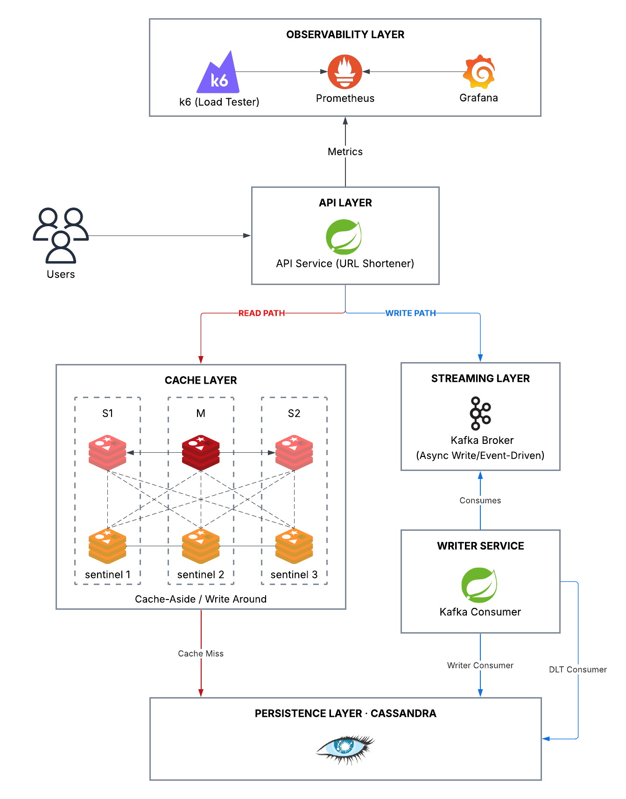

# Distributed URL Shortener Service

A horizontally scalable, fault-tolerant URL shortener built to demonstrate distributed system tradeoffs — caching, asynchronous writes, sentinel-based failover, and dead-letter handling — running on Kubernetes (k3s).

## Performance Highlights

- Validated on a 3-node EC2 Kubernetes cluster under load and fault injection.
- Horizontal API scaling increased peak write throughput from 2.09k req/s to 4.05k req/s.
- Redis caching raised peak read throughput to 6.51k req/s at 10,000 VUs.
- Kafka asynchronous writes reached 6.13k req/s, showing the benefit of decoupling request handling from persistence.
- Redis Sentinel failover preserved read availability during master replacement.
- Kafka retry and DLT handling ensured failed writes were durably captured instead of dropped.
- Benchmarking included baseline, horizontal scaling, cache, and async-write architectures for direct comparison.

## Documentation

| Document | Description |
| :--- | :--- |
| [docs/Project_Overview.md](docs/Project_Overview.md) | Architecture, design decisions, scalability strategy, fault tolerance |
| [docs/SETUP.md](docs/SETUP.md) | Step-by-step deployment and local/cloud setup guide |
| [docs/COMMANDS.md](docs/COMMANDS.md) | Command reference (Kubernetes, Docker, Redis, Kafka, Cassandra) |
| [docs/TESTING.md](docs/TESTING.md) | Load and fault-injection test guide |

---

## Architecture Overview
### Architecture Diagram

<p align="center">
  
</p>

### Tech Stack

| Layer | Technology |
| :--- | :--- |
| API Service | Java 21 + Spring Boot 3 |
| Writer Service | Java 21 + Spring Boot 3 (Kafka consumer) |
| Cache | Redis 7 (1 master + 2 replicas) + Redis Sentinel (3 pods) |
| Database | Apache Cassandra 4.1 (3-node StatefulSet, rf=2) |
| Streaming | Apache Kafka (external) |
| Orchestration | Kubernetes / k3s |
| Observability | Spring Boot Actuator + Prometheus + Grafana |
| Load Testing | k6 |
| Automation | Bash deploy scripts |

---

## Quick Start

See [docs/Setup.md](docs/Setup.md) for the full setup guide.

### Deploy with Scripts

From the repository root:

```bash
./scripts/deploy-all.sh
```

Teardown:

```bash
./scripts/teardown.sh
```

### API Usage

**Shorten a URL:**
```bash
curl -i -X PUT 'http://<NODE_IP>:30000/?short=abc&long=https://example.com'
```

**Redirect via short code:**
```bash
curl -i 'http://<NODE_IP>:30000/abc'
```

**Debug cache status:**
```bash
curl 'http://<NODE_IP>:30000/debug/cache/abc'
```

---

## Key Design Highlights

- **Cache-Aside Read Path**: reads check Redis replicas first; on cache miss the API falls back to Cassandra and lazily populates the Redis primary.
- **Write-Around Async Write Path**: PUT requests publish a Kafka event and return immediately; the Writer Service persists to Cassandra asynchronously.
- **Redis Sentinel Failover**: 3 Sentinel pods monitor the Redis master; on failure a replica is promoted automatically and the Spring client reconnects transparently.
- **Dead Letter Topic (DLT)**: failed Kafka messages are retried 3 times (exponential backoff), then routed to `url.write.dlt` and persisted to `url_shortener.failed_messages` in Cassandra — no write is silently dropped.
- **Multi-Node Kubernetes (k3s)**: designed for a 3-EC2-node cluster to validate node failover, network partition handling, and distributed recovery behavior under fault injection.

---

## Validation

- Load and fault injection scenarios: [docs/TESTING.md](docs/TESTING.md)
- Includes node failure, Redis Sentinel failover, Kafka consumer outage, Cassandra node failure, and Kafka DLT test.